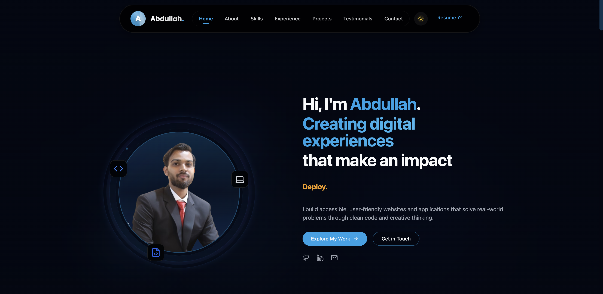
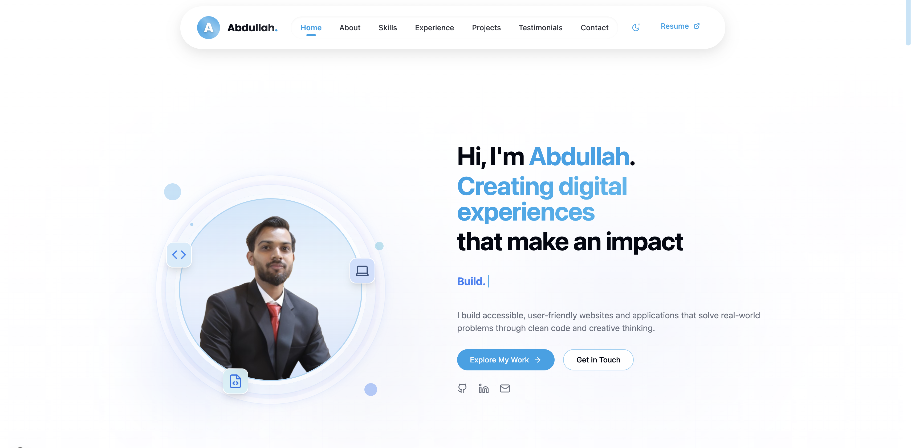
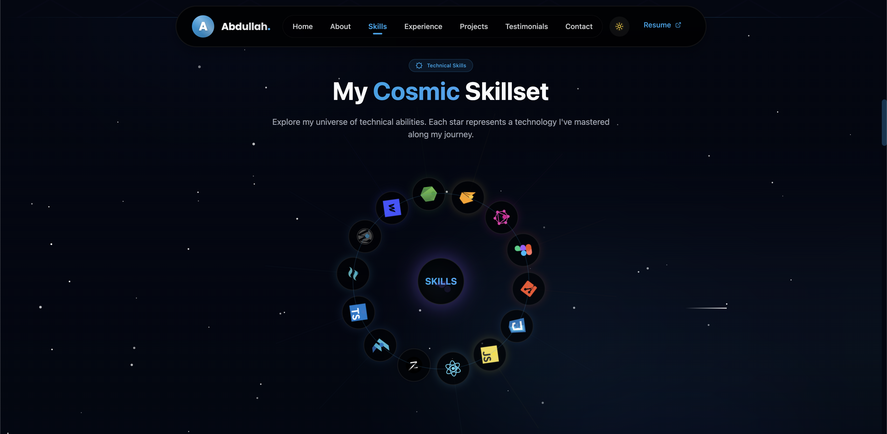

# Abdullah Khan - Full Stack Developer Portfolio

A modern, responsive full-stack developer portfolio built with **Next.js 15**, **Tailwind CSS**, and **Framer Motion**.

## 📸 Screenshots

### Home Page (Dark Mode)


### Home Page (Light Mode)


### Skills Section


### About Section


## 🚀 Getting Started

### Prerequisites
- Node.js 18.17 or later
- npm or yarn

### Installation

```bash
# Clone the repository
git clone https://github.com/Abdullahkhan1010/Portfolio.git

# Navigate to the project directory
cd Portfolio

# Install dependencies
npm install
```

### Development

```bash
npm run dev
```

Open [http://localhost:3000](http://localhost:3000) in your browser.

## 📁 Project Structure

```
Portfolio/
├── app/                      # Next.js app directory
├── components/               # Reusable React components
├── public/                   # Static assets
├── styles/                   # Global styles
└── package.json              # Project dependencies
```

## ✨ Features

- 🌓 **Dark/Light Mode** - Seamless theme switching
- 🎭 **Stunning Animations** - Powered by Framer Motion
- 📱 **Fully Responsive** - Perfect on all devices
- ⚡ **High Performance** - 90+ Lighthouse scores
- 🧩 **Component-Based** - Modular architecture
- 📬 **Contact Form** - Direct communication via Web3Forms
- ✅ **100% Accessibility** - WCAG compliant

## 🌐 Connect With Me

- **GitHub**: [@Abdullahkhan1010](https://github.com/Abdullahkhan1010)
- **LinkedIn**: [Abdullah Khan](https://www.linkedin.com/in/abdullah-khan-webdev/)
- **Email**: [abdullah.khan1010@gmail.com](mailto:abdullah.khan1010@gmail.com)

---

<div align="center">
  <p>Made with ❤️ by <strong>Abdullah Khan</strong></p>
</div>
